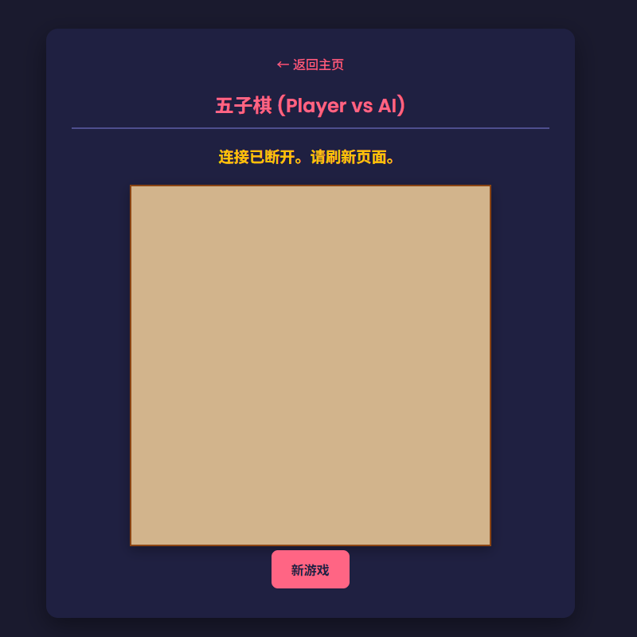

# 🎮 MicroPython 网页游戏合集 (Web Game Collection)

一个运行在 `ESP32` 上的 MicroPython 游戏中心。通过 Wi-Fi 连接，你可以在浏览器上实时游玩多种经典游戏。所有游戏逻辑均在单片机上运行！

## 📸 截图

|          游戏导航页          |             21点              |            五子棋            |
|:-----------------------:|:----------------------------:|:-------------------------:|
|  |  |  |

## ✨ 包含游戏 (Features)

本项目包含一个导航页和 5 款经典游戏：

* 🃏 **21点 (Blackjack):** 完整的 52 张牌和 A 牌智能计分逻辑。
* 🎰 **老虎机 (Slots):** 经典的三转轴老虎机。
* 🔢 **猜数字 (Guess Number):** 经典的 1-100 猜数字游戏。
* 🐎 **赛马 (Horse Racing):** 在 ESP32 上模拟完整比赛，前端通过动画重放赛况。
* ⚫⚪ **五子棋 (Gomoku):** 玩家 (PVE) 对战一个简单的 MicroPython AI。

## 🛠️ 技术栈 (Tech Stack)

* **硬件 (Hardware):** `ESP32` (推荐) / `ESP8266` (可能内存不足)
* **后端 (Backend):** `MicroPython`
* **Web 服务器:** `MicroWebSrv` (用于提供网页服务和 WebSocket)
* **实时通信:** `WebSockets` (用于浏览器和 ESP32 之间的双向通信)
* **前端 (Frontend):** `HTML` / `CSS` / `JavaScript` (无框架)

## 🚀 如何运行 (How to Run)

1.  **硬件准备:**
    * 一块 ESP32 开发板。
    * 使用 Thonny IDE 或类似工具刷入最新的 MicroPython 固件。

2.  **安装库:**
    * 在 Thonny 中，连接到你的 ESP32。
    * 转到 "工具" > "管理包"。
    * 搜索 `microwebsrv` 并安装。

3.  **配置 WiFi:**
    * 打开 `boot.py` 文件。
    * 修改 `SSID = '你的WiFi名称'` 和 `PASSWORD = '你的WiFi密码'` 为你自己的 Wi-Fi 信息。

4.  **上传文件:**
    * 将本项目中的所有 `.py` 文件和 `www` 文件夹**完整地**上传到 ESP32 的根目录。

5.  **运行:**
    * 重启 ESP32 (拔掉 USB 再插上，或按 RST 按钮)。
    * 在 Thonny 的 Shell (REPL) 中查看 `boot.py` 输出的 IP 地址 (例如 `192.168.1.100`)。
    * 在你的电脑或手机浏览器中访问该 IP 地址。

6.  **开始游戏!**

## 📄 许可证 (License)

本项目采用 MIT 许可证。详情请见 `LICENSE` 文件。
